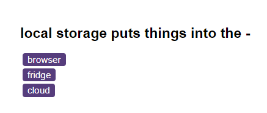
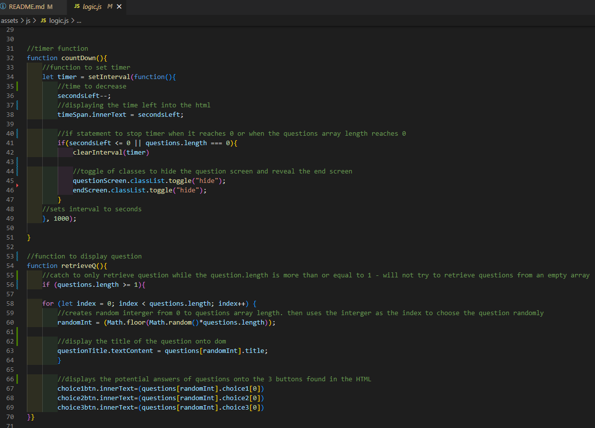

# Code-Quiz---WC6

## Description

Made in response to the week 6 challenge at Trilogy Education skills bootcamp.

We were tasked with using Java Script to create a JS quiz. The acceptance criteria included:

* A start button that when clicked a timer starts and the first question appears.
 
  * Questions contain buttons for each answer.
  * 
  * When answer is clicked, the next question appears
  * 
  * If the answer clicked was incorrect then subtract time from the clock

* The quiz should end when all questions are answered or the timer reaches 0.

  * When the game ends, it should display their score and give the user the ability to save their initials and their score

## Installation

No special installation is necessary. file type include HTML, CSS and JavaSript and should run on most browsers.

## Usage

The project is to be used as a learning aid by students who are studying Java-script. I made copius notes in the script files so once they have done the quiz they can look at the files and follow my logic.

*example question*

*screenshot to show notes in script file*

It can also be used by potential furture employers to see my learning journey.

## Credits

Starter code provided by Trilogy Education Skills Bootcamp.

## License

Please refer to the license in the repo.

## link to live site here

https://ncstorey.github.io/Code-Quiz---WC6/ 

